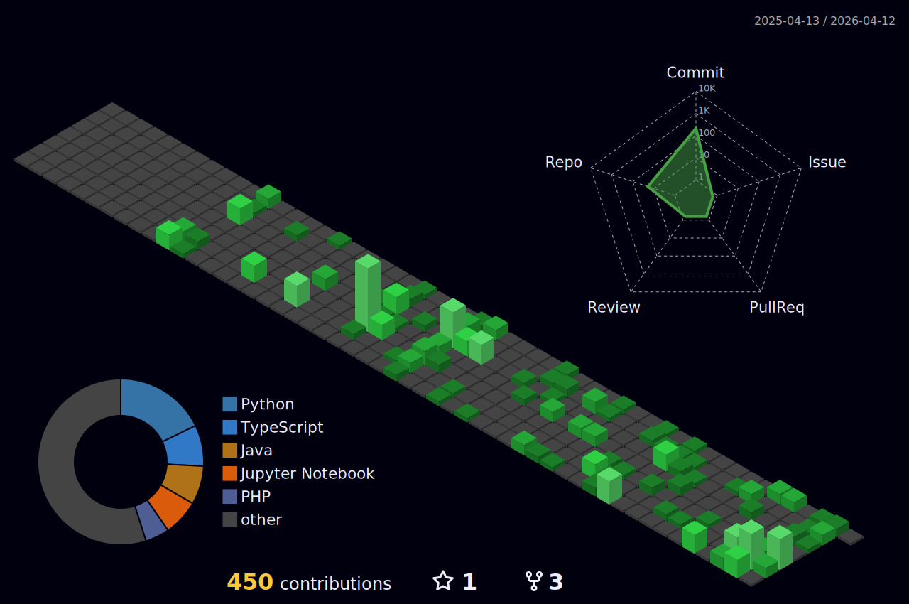

<h1 align="center">Hi, I'm Sakuya133</h1>

  

  

  
  
  

### 3D Activity

  

## About Me
- Passionate about cybersecurity, software engineering, and applied cryptography.
- Interested in secure systems, defensive security, and clean software architecture.
- Currently learning more about blue team workflows, secure development, and cryptographic thinking.

## Tech Stack

  

## GitHub Stats

  
  

## Snake Activity

  

## Motto
> Learn deeply. Build securely. Defend intelligently.
